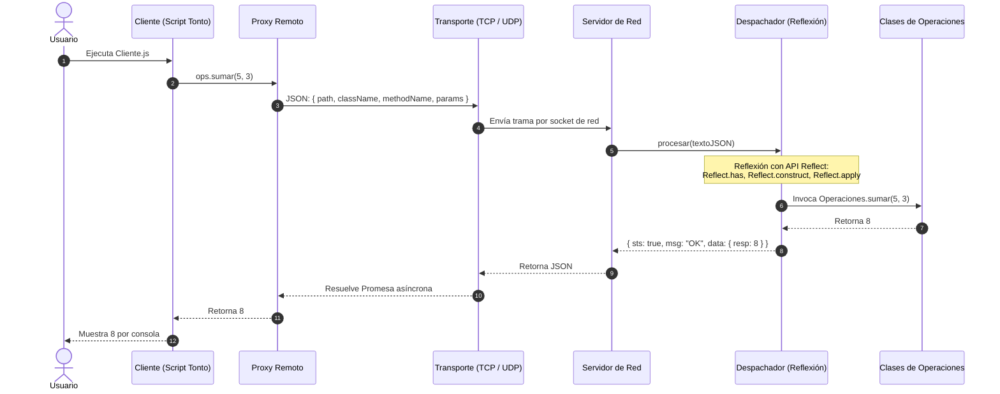

# Calculadora Distribuida Cliente-Servidor (TCP y UDP) en Node.js

Este proyecto implementa una arquitectura distribuida de llamadas a métodos remotos (**RPC - Remote Procedure Call**) aplicando los patrones de diseño **Proxy** y **Dispatcher**, con soporte para protocolos de transporte **TCP** y **UDP**, y utilizando **Reflexión** en Node.js.

---

## 📐 Arquitectura y Cómo se Desarrolló

El sistema está diseñado bajo el principio de separación de responsabilidades y transparencia en la comunicación:



### 1. Cliente Tonto (`Cliente.js`)
- **`Cliente.js`**: Es un cliente ligero ("tonto"), sin lógica de negocio ni manipulación directa de sockets de red. Solo instancia los proxies (`new OperacionesProxy()`, `new MatrixProxy()`), invoca los métodos deseados (`sumar`, `restar`, `mult`, `div`, `suma`, `inversa`) y muestra los resultados devueltos por consola.

### 2. Patrón Proxy en el Cliente (Transparencia Remota)
- **`ProxyRemoto.js`**: Utiliza el objeto nativo `Proxy` de ES6 para interceptar dinámicamente cualquier invocación de método sobre el objeto cliente. En lugar de escribir un método local por cada operación remota, el proxy intercepta la llamada, empaqueta el nombre del archivo, la clase, el método y los parámetros en una solicitud JSON, y delega el envío a la capa de transporte mediante promesas asíncronas (`async/await`).
- **`OperacionesProxy.js` y `MatrixProxy.js`**: Heredan de `ProxyRemoto`, indicando a qué módulo y clase remota apuntan (`Operaciones.js` o `Matrix.js`), permitiendo al usuario programar en el cliente exactamente como si las clases estuvieran en local.

### 3. Capa de Transporte Orientada a Objetos (TCP y UDP)
- **`ClienteTcp.js`**: Gestiona la conexión mediante sockets de flujo continuo (`net.Socket`). Implementa un protocolo delimitado por saltos de línea (`\n`) y una cola de promesas FIFO para asociar respuestas asíncronas con sus peticiones.
- **`ClienteUdp.js`**: Gestiona la comunicación orientada a datagramas sin conexión (`dgram`). Envía paquetes UDP y resuelve las promesas conforme recibe los mensajes de respuesta.

### 4. Patrón Dispatcher con Reflexión en el Servidor
- **`Despachador.js`**: Es el núcleo del servidor. En lugar de utilizar estructuras rígidas con `switch/case` o múltiples `if/else` para cada función matemática, utiliza la **API nativa de Reflexión de JavaScript (`Reflect`)**:
  - `Reflect.has(modulo, className)`: Valida e inspecciona la existencia de la clase en el módulo solicitado.
  - `Reflect.has(Clase.prototype, methodName)`: Determina si el método pertenece al prototipo (instancia) o a la clase (estático).
  - `Reflect.construct(Clase, [])`: Instancia la clase de manera dinámica y reflexiva.
  - `Reflect.apply(metodo, objetivo, params)`: Invoca el método dinámicamente inyectando el array de parámetros sin importar la cantidad de argumentos.
- **Seguridad**: Valida que las rutas solicitadas no salgan del directorio permitido (`servidor/operaciones`) e impide la invocación de métodos privados o constructores directos.

### 5. Servidores de Red
- **`tcpServer.js`**: Servidor TCP (`net`) escuchando en `0.0.0.0:8080`, acumulando fragmentos de stream en un buffer y procesando línea por línea.
- **`udpServer.js`**: Servidor UDP (`dgram`) escuchando en `0.0.0.0:8081`, recibiendo datagramas y respondiendo a la dirección y puerto remitente (`rinfo`).

---

## 📁 Estructura del Proyecto

```text
calculadora-tcp-udp-main/
│
├── README.md                           # Documentación y guía del proyecto
│
└── calculadora/
    ├── package.json                    # Scripts npm y metadatos
    │
    ├── cliente/                        # Código del Cliente
    │   ├── Cliente.js                  # Cliente principal "tonto" (ejecuta operaciones)
    │   ├── ProxyRemoto.js              # Clase base Proxy interceptora
    │   ├── OperacionesProxy.js         # Proxy para operaciones aritméticas
    │   ├── MatrixProxy.js              # Proxy para operaciones matriciales
    │   ├── ClienteTcp.js               # Transporte TCP con sockets net
    │   ├── ClienteUdp.js               # Transporte UDP con sockets dgram
    │   └── config.js                   # Configuración de IP, puerto y protocolo
    │
    └── servidor/                       # Código del Servidor
        ├── comunicacion/
        │   ├── Despachador.js          # Clase Dispatcher con Reflexión (Reflect API)
        │   ├── tcpServer.js            # Servidor TCP (puerto 8080)
        │   └── udpServer.js            # Servidor UDP (puerto 8081)
        │
        └── operaciones/                # Lógica de Negocio
            ├── Operaciones.js          # Métodos: sumar, restar, mult, div, sumarTodos
            └── Matrix.js               # Métodos: suma de matrices, inversa (Gauss-Jordan)
```

---

## 📦 Protocolo de Comunicación (Formato de Tramas JSON)

### Solicitud (Request):
```json
{
  "path": "Operaciones.js",
  "className": "Operaciones",
  "methodName": "sumar",
  "params": [5, 3]
}
```

### Respuesta Exitosa:
```json
{
  "sts": true,
  "msg": "OK",
  "data": {
    "resp": 8
  }
}
```

### Respuesta con Error:
```json
{
  "sts": false,
  "msg": "No se puede dividir entre cero",
  "data": {}
}
```

---

## 🚀 Guía de Uso Rápido (En la Misma Máquina)

Abre una terminal en la carpeta `calculadora`:

```bash
cd calculadora
```

### Modo TCP:
1. **Iniciar Servidor TCP:**
   ```bash
   npm run servidor:tcp
   ```
2. **En otra terminal, ejecutar Cliente TCP:**
   ```bash
   npm run cliente:tcp
   ```

### Modo UDP:
1. **Iniciar Servidor UDP:**
   ```bash
   npm run servidor:udp
   ```
2. **En otra terminal, ejecutar Cliente UDP:**
   ```bash
   npm run cliente:udp
   ```

---

## 🌐 Comunicación Entre Dos Dispositivos Distintos

Para que una computadora ejecute el **Servidor** y otra computadora diferente ejecute el **Cliente**:

### Paso 1: Conectar ambos equipos a la misma red
Ambos dispositivos deben estar conectados a la misma red Wi-Fi o red local por cable.

### Paso 2: Obtener la IP del Dispositivo Servidor (Dispositivo A)
En la máquina donde correrá el servidor:
- **Windows**: Abre PowerShell o CMD y escribe:
  ```powershell
  ipconfig
  ```
  Busca la línea **"Dirección IPv4"** de tu adaptador de red (ejemplo: `192.168.1.50`).
- **Linux / Mac**:
  ```bash
  ip addr
  # o
  ifconfig
  ```

### Paso 3: Iniciar el Servidor en el Dispositivo A
Entra en la carpeta `calculadora`:
- Para **TCP** (puerto 8080):
  ```bash
  node servidor/comunicacion/tcpServer.js 0.0.0.0 8080
  ```
- Para **UDP** (puerto 8081):
  ```bash
  node servidor/comunicacion/udpServer.js 0.0.0.0 8081
  ```
*(El uso de `0.0.0.0` hace que el servidor escuche peticiones provenientes de cualquier tarjeta de red o IP externa).*

> [!IMPORTANT]
> **Permisos de Firewall en el Dispositivo A**:
> En Windows, al iniciar el servidor por primera vez, suele salir un aviso de Windows Defender Firewall. Marca la casilla para permitir el acceso en redes privadas. Si no logran conectarse, revisa que los puertos `8080` (TCP) y `8081` (UDP) no estén bloqueados por el Firewall.

### Paso 4: Ejecutar el Cliente en el Dispositivo B
En la segunda computadora, teniendo Node.js instalado y el proyecto clonado/copiado:

- **Para comunicarse por TCP:**
  ```bash
  node cliente/Cliente.js 192.168.1.50 8080 tcp
  ```
- **Para comunicarse por UDP:**
  ```bash
  node cliente/Cliente.js 192.168.1.50 8081 udp
  ```

*(Sustituye `192.168.1.50` por la IP real obtenida en el Paso 2).*

---

## 🛠️ Tecnologías Empleadas
- **Node.js**: Entorno de ejecución de JavaScript del lado del servidor.
- **Módulo `net`**: Sockets TCP orientados a conexión.
- **Módulo `dgram`**: Sockets UDP de datagramas sin conexión.
- **API `Reflect` y `Proxy`**: Reflexión e introspección de objetos e invocación dinámica en tiempo de ejecución.
