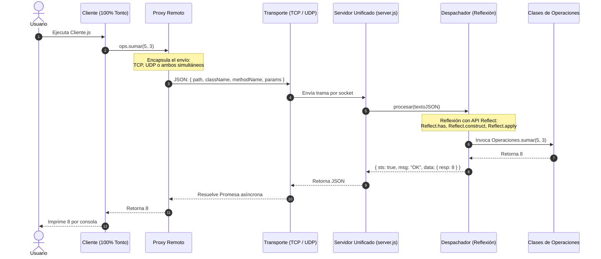

# Calculadora Distribuida Cliente-Servidor (TCP y UDP) en Node.js

Este proyecto implementa una arquitectura distribuida de llamadas a métodos remotos (**RPC - Remote Procedure Call**) aplicando los patrones de diseño **Proxy** y **Dispatcher**, con soporte para protocolos de transporte **TCP** y **UDP**, y utilizando **Reflexión** en Node.js.

---

## 📐 Arquitectura del Proyecto

El sistema está diseñado bajo el principio de separación total de responsabilidades:
- **Cliente 100% tonto**: No contiene lógica de negocio ni lógica de protocolos.
- **Proxy Remoto**: Encapsula transparentemente el transporte (TCP, UDP o ambos en paralelo).
- **Servidor Unificado**: Escucha peticiones TCP y UDP en el mismo puerto y las despacha con Reflexión.



### 1. Cliente Tonto (`Cliente.js`)
El cliente no tiene **ningún condicional, `if`, `else` ni lógica interna**. Es estrictamente un consumidor de proxies:
```javascript
let ops = new OperacionesProxy();
let r = await ops.sumar(5, 3);
console.log(r);
...
```

### 2. Patrón Proxy (`ProxyRemoto.js`)
- Utiliza `new Proxy()` de JavaScript para interceptar las llamadas a cualquier método.
- Encapsula la decisión del transporte: si se envía por **TCP**, por **UDP**, o **por ambos al mismo tiempo** (`Promise.all([clienteTcp.enviar(req), clienteUdp.enviar(req)])`).

### 3. Servidor Unificado (`server.js`)
- Un solo proceso que activa simultáneamente:
  - Servidor TCP en `0.0.0.0:8080`.
  - Servidor UDP en `0.0.0.0:8080`.
- Ambos atienden en paralelo y delegan el procesamiento al `Despachador`.

### 4. Patrón Dispatcher con Reflexión (`Despachador.js`)
- En el servidor no hay código rígido (`switch/case`).
- Se utiliza la **API nativa de Reflexión (`Reflect`)**:
  - `Reflect.has(modulo, className)`
  - `Reflect.construct(Clase, [])`
  - `Reflect.apply(metodo, objetivo, params)`

---

## 📁 Estructura de Archivos

```text
calculadora/
├── package.json                    # Scripts de ejecución
│
├── cliente/                        # Capa Cliente
│   ├── Cliente.js                  # Cliente 100% tonto (solo invoca y muestra)
│   ├── ProxyRemoto.js              # Interceptor y gestor de transporte
│   ├── OperacionesProxy.js         # Proxy de operaciones aritméticas
│   ├── MatrixProxy.js              # Proxy de matrices
│   ├── ClienteTcp.js               # Conexión socket TCP
│   ├── ClienteUdp.js               # Conexión datagrama UDP
│   └── config.js                   # Configuración de IP, puerto y protocolo
│
└── servidor/                       # Capa Servidor
    ├── comunicacion/
    │   ├── server.js               # Servidor UNIFICADO (TCP + UDP en puerto 8080)
    │   ├── Despachador.js          # Clase Dispatcher con Reflexión (Reflect API)
    │   ├── tcpServer.js            # Servidor TCP individual (opcional)
    │   └── udpServer.js            # Servidor UDP individual (opcional)
    │
    └── operaciones/                # Lógica de Negocio
        ├── Operaciones.js          # sumar, restar, mult, div, sumarTodos
        └── Matrix.js               # suma de matrices, inversa
```

---

## 🚀 Cómo Probarlo

### 1. Activar el Servidor (en la PC / VS Code)
Desde la carpeta `calculadora`:
```powershell
node servidor/comunicacion/server.js 0.0.0.0 8080
```
*(O con `npm run servidor`)*.

Verás:
```text
[TCP] Servidor escuchando en 0.0.0.0:8080
[UDP] Servidor escuchando en 0.0.0.0:8080
========================================================
 Servidor Calculadora ACTIVO (TCP + UDP) en 0.0.0.0:8080
========================================================
```

---

### 2. Activar el Cliente (en el Celular con Termux o en otra terminal)
Ejecutas el cliente tonto indicando la IP de tu PC:

- **Para enviar por AMBAS conexiones a la vez (TCP y UDP en simultáneo):**
  ```bash
  node cliente/Cliente.js <IP_DE_TU_PC> 8080 ambos
  ```
  *(O simplemente: `node cliente/Cliente.js <IP_DE_TU_PC>`)*

- **O si quieres forzar solo TCP:**
  ```bash
  node cliente/Cliente.js <IP_DE_TU_PC> 8080 tcp
  ```

- **O si quieres forzar solo UDP:**
  ```bash
  node cliente/Cliente.js <IP_DE_TU_PC> 8080 udp
  ```

En el cliente verás la salida limpia original:
```text
8
6
12
5
[ [ 6, 8 ], [ 10, 12 ] ]
[ [ 0.6, -0.7 ], [ -0.2, 0.4 ] ]
```
Y en el servidor verás cómo procesa las solicitudes recibidas por TCP y UDP.
